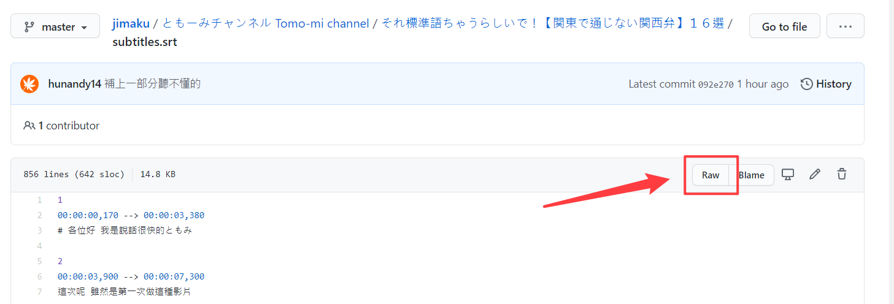
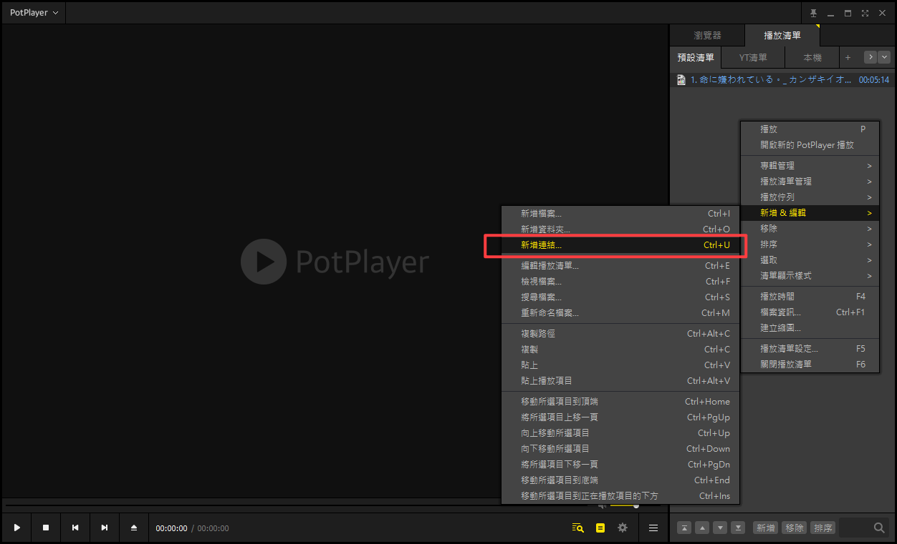
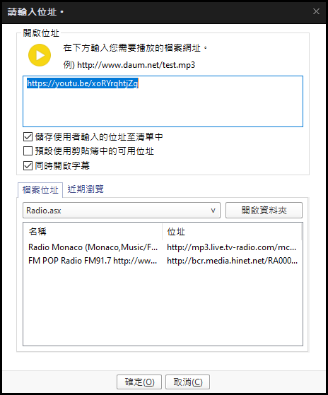

## 如何在線上外掛字幕觀看
### 字幕
字幕要載下來是免不了了，下載方法如下圖。  

先點進去你載的字幕分頁  

然後點 RAW 之後會進去一個純文字介面，空白處按右鍵另存就可以了。另存新檔的時候注意看一下附檔名把後面的.txt消除。

### 播放器
再來是播放器的選擇，這邊選用 potplayer 似乎只有這個可以播線上的檔案。

載點：[PotPlayer_1.7.20977_setup_azo](https://www.azotaiwan.com/_dl_rC5CFd3nVq/PotPlayer_1.7.20977_setup_azo.exe.htm)

> 版本我挑過了是2019.11月版本的，12月開始有強迫推廣告。20年開始內帶流氓軟體 Segurazo，建議不要更新也不要裝最新版的，沒人知道有沒有拿掉。

裝好之後打開介面按新增連結(快捷CTRL+U)  

然後輸入網址  

之後就可以播放了，把剛剛載好的字幕直接拉到播放器中就可以掛載了。
