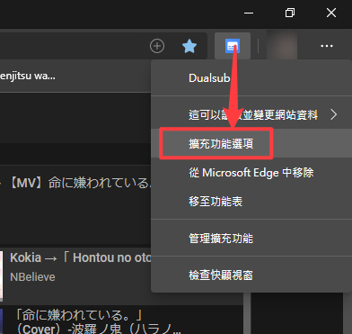
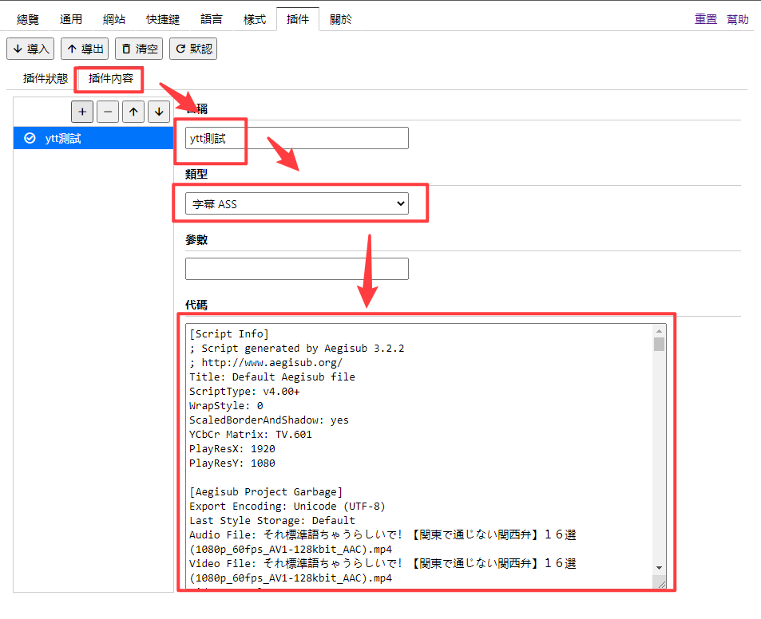
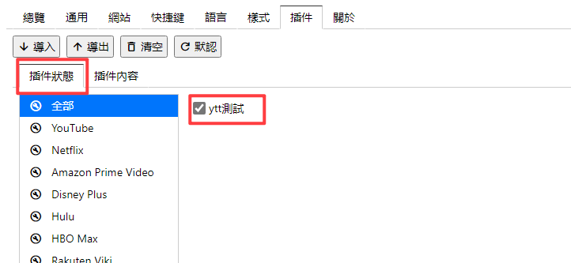
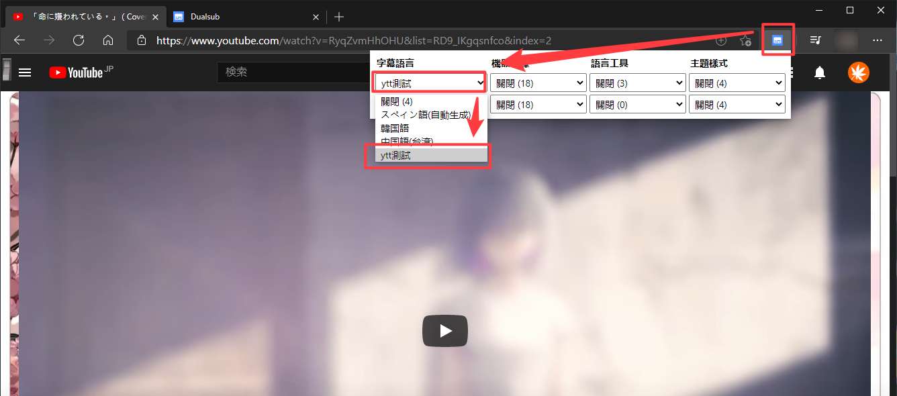

## 如何在線上外掛字幕觀看

### chrome插件 實現
要使用的插件是 Dualsub 這個插件可以實現直接在瀏覽器掛載字幕。  

官方說明頁面：https://www.dualsub.xyz/plugin-usage.html  
插件商店網址：https://chrome.google.com/webstore/detail/gnlibmlfpencglodjpgnalbdebfhpmfp

先點右鍵 擴充功能選項 進入管理介面  

然後選擇 插件-> 插件內容

- 第一個 名稱填一個你可以辨別的就好，等一下會用到  
- 第二個 字幕類型要選對，就是檔案附檔名，選錯會掛載失敗  
- 第三個 代碼處，直接把字幕內容全部複製進去就可以了  

在來到插件狀態，把剛剛的設定的名稱打勾

然後回到YT的影片上，右上角點選Dualsub插件，選擇剛剛做的字幕就可以看到了

     

### 播放器 實現
字幕下載  

先點進去你載的字幕分頁  

然後點 RAW 之後會進去一個純文字介面，空白處按右鍵另存就可以了。另存新檔的時候注意看一下附檔名把後面的.txt消除。

再來是播放器，這邊用 Potplayer。他可以播線上的檔案。
載點：[PotPlayer_1.7.20977_setup_azo](https://www.azotaiwan.com/_dl_rC5CFd3nVq/PotPlayer_1.7.20977_setup_azo.exe.htm)

> 版本我挑過了是2019.11月版本的，12月開始有強迫推廣告。20年開始內帶流氓軟體 Segurazo，建議不要更新也不要裝最新版的，沒人知道有沒有拿掉。

裝好之後打開介面按新增連結(快捷CTRL+U)  

然後輸入網址  

之後就可以播放了，把剛剛載好的字幕直接拉到播放器中就可以掛載了。
